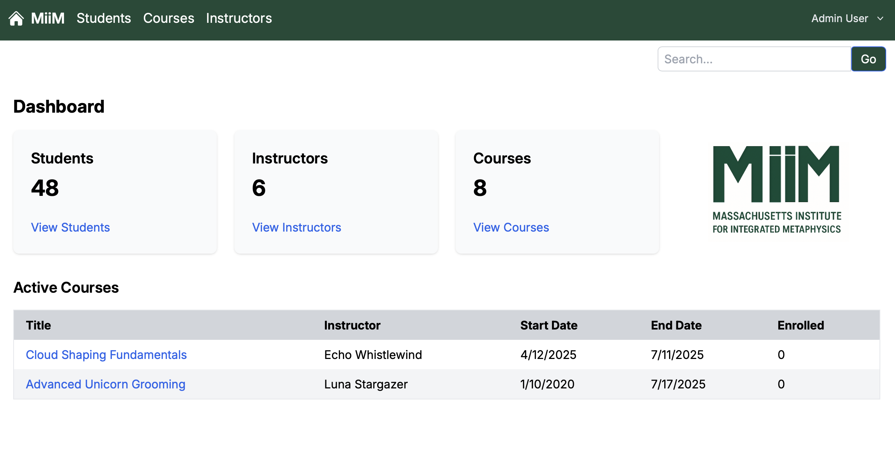
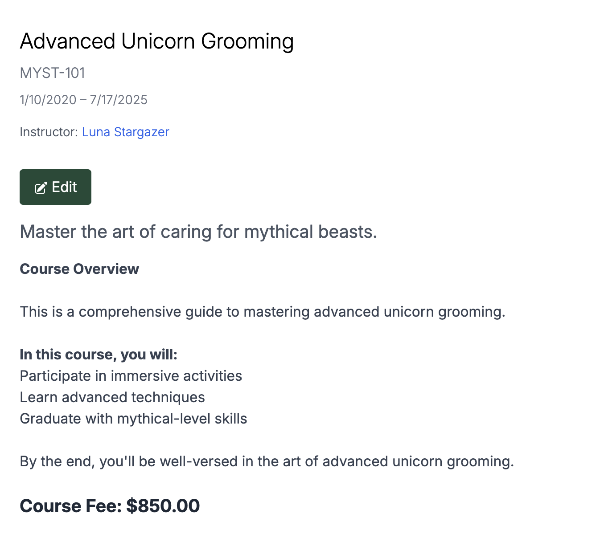

---

# CRM Project - Massachusetts Institute for Integrated Metaphysics

An example of a lightweight CRM (Customer Relationship Management) platform built with:

- **Django + Django REST Framework** for the backend API
- **Remix + TypeScript + Tailwind CSS** for the frontend
- Designed for managing students, courses, instructors, and registrations
- Demo-friendly layout with modular, modern code structure

### About the MiiM

MiiM is a fictional institute created for the purpose of this project, a mix of MIT, Miskatonic U, and Hogwarts. It serves as an abstact placeholder for a real-world organization.

MiiM is a university located mostly in the New England of the US, and usually now. Go Flaming Eyes!

### About this Repo

This is a sample Customer Relationship Management (CRM) application developed as part of a software engineering portfolio. It demonstrates full-stack development skills using TypeScript, React, and Remix.

---

## 📸 Screenshots

### Dashboard View



### Student Registration



---

## 🛠️ Tech Stack

- Backend: Django 5, Django REST Framework
- Frontend: Remix, TypeScript, Tailwind CSS
- Database: SQLite (for local development)
- Hosting: Localhost (dev only)

---

## ✨ Features

- User management (Students, Faculty, Admins)
- Course creation and registration
- RESTful API backend
- Full-featured React frontend
- Modular, scalable project structure

---

## 🚀 Setup Instructions

### 1. Clone the repository

```bash
git clone https://github.com/radcliffetech/crm-app.git
cd crm-app
```

### 2. Backend Setup (Django)

```bash
cd packages/backend-django
python3 -m venv env
source env/bin/activate
pip install -r requirements.txt
python manage.py migrate
python manage.py runserver 8080
```

### 3. Frontend Setup (Remix)

Open a second terminal:

```bash
cd packages/frontend-remix
npm install
npm run dev
```

You should now have:

- Backend running at `http://localhost:8080/`
- Frontend running at `http://localhost:5173/`

---

## 📦 Project Structure

```
crm-app/
├── packages/
│   ├── backend-django/   # Django REST Framework API
│   └── frontend-remix/   # Remix frontend with React, Tailwind, and TS
└── README.md
```

---

## 🧱 Backend Setup (Django)

1. Navigate to the backend directory:

   ```bash
   cd packages/backend-django
   ```

2. Create and activate a virtual environment:

   ```bash
   python3 -m venv env
   source env/bin/activate
   ```

3. Install dependencies:

   ```bash
   pip install -r requirements.txt
   ```

4. Run migrations and load sample data:

   ```bash
   python manage.py migrate
   python manage.py reset_database
   ```

5. Start the server:
   ```bash
   python manage.py runserver 8080
   ```

---

## 🎨 Frontend Setup (Remix)

1. Navigate to the frontend directory:

   ```bash
   cd packages/frontend-remix
   ```

2. Install dependencies:

   ```bash
   npm install
   ```

3. Start the development server:
   ```bash
   npm run dev
   ```

---

## 🛣️ Roadmap

Planned future enhancements for the CRM:

- [ ] Support multiple user roles: Admin, Faculty, and Students
- [ ] Implement a simple payment processing system
- [ ] Add a messaging system for CRM users
- [ ] Build a dynamic course catalog with materials
- [ ] Enhance README with additional live screenshots
